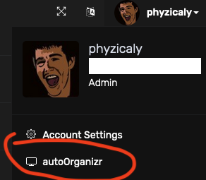
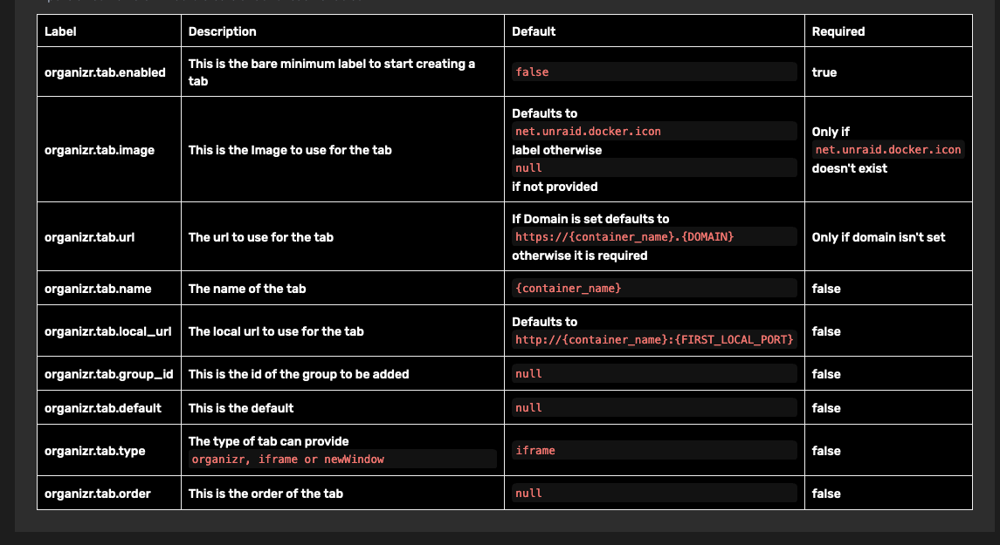

# autoOrganizr Organizr Plugin

| :exclamation: Important                                                                                                                             |
| :-------------------------------------------------------------------------------------------------------------------------------------------------- |
| To add this plugin to Organizr, please add <https://github.com/phyzical/Organizr-Plugins> to the Plugins Marketplace within your Organizr instance. |

Go to the settings;
Set the docker proxy url if not the same as the default `http://docker:2375`
By default runs on cron once an hour, can be changed in settings

otherwise

To run after installing simply click the new menu item

Configuration is just a matter of using the following labels:

Assumes usage of the [docker proxy server](https://github.com/linuxserver/docker-socket-proxy)

TODO:
Support docker socket bind?
